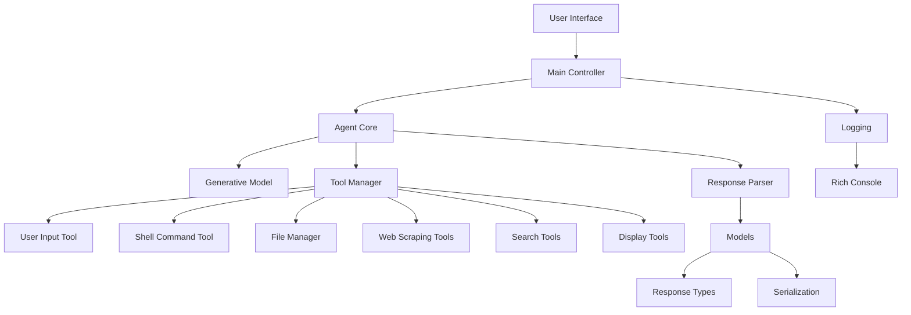

# QuantaFold


## Table of Contents

- [Overview](#overview)
- [Architecture](#architecture)
- [Features](#features)
- [Installation](#installation)
- [Usage](#usage)
- [Tools](#tools)
- [Examples](#examples)
- [Contributing](#contributing)
- [License](#license)

---

## Overview

QuantaFold is a versatile and intelligent assistant designed to help users perform a wide range of tasks seamlessly. Leveraging the power of advanced language models and a suite of integrated tools, this project aims to provide a comprehensive solution for automating processes, fetching information, executing commands, and more.

Whether you're looking to interact with Wikipedia, execute shell commands, manage files, or scrape web content, QuantaFold is equipped to handle your needs with efficiency and precision.

---

## Architecture

The architecture of QuantaFold is modular, ensuring scalability, maintainability, and ease of integration with additional tools or features in the future. Below is a high-level overview of the system's architecture.



### Components

- **User Interface**: Facilitates interaction between the user and the agent, handling input and displaying responses.
- **Main Controller (`main.py`)**: Orchestrates the flow of data, managing user inputs, invoking the agent, and handling outputs.
- **Agent Core (`agent.py`)**: The heart of the assistant, responsible for processing queries, managing tool executions, and maintaining session state.
- **Generative Model (`generative_model.py`)**: Interfaces with language models to generate coherent and contextually relevant responses.
- **Tool Manager (`tools/`)**: A collection of tools that extend the agent's capabilities, including:
  - **User Input Tool**: Handles enhanced user input, supporting multiline entries.
  - **Shell Command Tool**: Executes shell commands and returns outputs.
  - **File Manager**: Manages file reading, writing, and directory listing.
  - **Web Scraping Tools**: Utilize BeautifulSoup for parsing web content.
  - **Search Tools**: Interface with DuckDuckGo and Wikipedia for fetching information.
  - **Display Tools**: Render content with rich formatting for better user experience.
- **Response Parser (`response_xml_parser.py` & `response_parser.py`)**: Parses and validates responses generated by the agent.
- **Models (`models/`)**: Define data structures for handling responses, tools, and configurations.
- **Logging**: Implements comprehensive logging using the `rich` library for enhanced visibility and debugging.

---

## Features

- **Multiline User Input**: Allows users to input multi-line queries, enhancing the depth and clarity of interactions.
- **Integrated Tools**: A suite of tools for executing shell commands, managing files, scraping web content, and performing searches.
- **Rich Logging and Display**: Utilizes the `rich` library to provide colorful and structured logs, panels, and formatted outputs.
- **Configurable Generative Models**: Supports various language models with customizable parameters like temperature and token limits.
- **Modular Design**: Easily extendable with additional tools and features due to its modular architecture.
- **Error Handling**: Robust error handling mechanisms to ensure smooth and uninterrupted user experiences.

---

## Installation

### Prerequisites

- **Python 3.9+**: Ensure that Python is installed on your system. You can download it from [here](https://www.python.org/downloads/).
- **Poetry**: Used for dependency management. Install Poetry by following the instructions [here](https://python-poetry.org/docs/#installation).

### Steps

1. **Clone the Repository**

    ```bash
    git clone https://github.com/yourusername/quantafold.git
    cd quantafold
    ```

2. **Install Dependencies**

    ```bash
    poetry install
    ```

3. **Activate the Virtual Environment**

    ```bash
    poetry shell
    ```

4. **Configuration**

    Rename the `.env.example` to `.env` and set your configurations if necessary.

    ```bash
    cp .env.example .env
    ```

---

## Usage

To start the QuantaFold, run the `main.py` script:

```bash
python src/main.py
```

Follow the on-screen prompts to interact with the agent. You can enter your queries, and the agent will utilize the integrated tools to provide comprehensive responses.

### Exiting the Session

Type `quit` or `exit` to terminate the session gracefully.

---

## Tools

QuantaFold integrates a variety of tools to extend its functionality. Below is a comprehensive list of the available tools:

### 1. User Input Tool

- **Description**: Handles enhanced user inputs, supporting multi-line entries for more detailed queries.
- **Usage**: Prompts the user for input and captures their response.

### 2. Shell Command Tool

- **Description**: Executes shell commands and returns their outputs.
- **Usage**: Useful for performing system-level operations directly from the assistant.

### 3. File Manager
#### a. File Reader

- **Description**: Reads the contents of a specified file and returns its content.
- **Usage**: `FILE_READER` tool with `file_path` and `encoding` arguments.

#### b. File Writer

- **Description**: Writes content to a specified file, creating it if it doesn't exist.
- **Usage**: `FILE_WRITER` tool with `file_path`, `content`, `encoding`, and `mode` arguments.

#### c. File Tree

- **Description**: Lists all files in a directory in a tree-like structure, detailing their nature and size.
- **Usage**: `FILE_TREE_TOOL` tool with `directory` and `depth` arguments.

### 4. Web Scraping Tools
#### BeautifulSoup Tool

- **Description**: Scrapes and parses web pages using BeautifulSoup, extracting text, links, images, or the entire HTML content.
- **Usage**: `READ_WEBPAGE` tool with `url`, `parser`, `extract_type`, and `timeout` arguments.

### 5. Search Tools
#### DuckDuckGo Search Tool

- **Description**: Performs web searches using DuckDuckGo and returns relevant results.
- **Usage**: `SEARCH_DUCKDUCKGO` tool with `query` and `max_results` arguments.

#### Wikipedia Tool

- **Description**: Searches Wikipedia for a given query and returns a summary of the corresponding article.
- **Usage**: `SEARCH_WIKIPEDIA` tool with `query`, `lang`, and `max_lines` arguments.

### 6. Display Tools
#### Display Content Tool

- **Description**: Renders content with rich formatting options using the `rich` library.
- **Usage**: `DISPLAY_CONTENT` tool with `content`, `content_type`, and `style` arguments.

### 7. LLM Agent Tool

- **Description**: Generates AI responses based on a specified persona, prompt, and context without prior conversation memory.
- **Usage**: `LLM_AGENT` tool with `persona`, `prompt`, `context`, and `temperature` arguments.

---

## Examples

### Example 1: Fetching Wikipedia Summary

```bash
# User Input
Enter your question (press Enter twice to submit):
What is the capital of France?

# QuantaFold Response
🤖 AI Assistant

Welcome to your AI Assistant!

This tool can help you with the following:

* SEARCH_WIKIPEDIA: Search Wikipedia for a given query and return a summary
* SHELL_COMMAND: Execute a shell command and return its output
* FILE_READER: Read the contents of a file and return its content
* FILE_WRITER: Write content to a file, creating the file if it doesn't exist
* USER_INPUT: Prompts the user for input and returns their response
* LLM_AGENT: Generates AI responses based on a specified persona, prompt, and context
* DISPLAY_CONTENT: Display content to the user with rich formatting and styling options
* FILE_TREE_TOOL: List all files in a directory in a tree view with information about the nature of the file (file/directory) and size
* DUCKDUCKGO_SEARCH: Search DuckDuckGo for a given query and return relevant results
* BEAUTIFULSOUP: Read and parse web pages using BeautifulSoup

Type 'quit' or 'exit' to end the session.
Enter your questions in multiple lines - press Enter twice to submit.

[bold cyan]Thinking...[/]

[green]Response:[/green]
The capital of France is Paris.
```

### Example 2: Executing a Shell Command

```bash
# User Input
Enter your question (press Enter twice to submit):
List all files in the current directory.

# QuantaFold Response
🤖 AI Assistant

...

[bold cyan]Thinking...[/]

[green]Response:[/green]
- main.py (File, Size: 4985 bytes)
- tools/ (Directory, Size: -)
  - user_input.py (File, Size: 3399 bytes)
  - shell_command.py (File, Size: 2652 bytes)
  ...
```

### Example 3: Reading a File

```bash
# User Input
Enter your question (press Enter twice to submit):
Read the contents of config.yaml.

# QuantaFold Response
🤖 AI Assistant

...

[bold cyan]Thinking...[/]

[green]Response:[/green]
# Configuration File
setting1: value1
setting2: value2
...
```

---

## Contributing

Contributions are welcome! If you'd like to improve QuantaFold, please follow these steps:

1. **Fork the Repository**
2. **Create a New Branch**

    ```bash
    git checkout -b feature/YourFeature
    ```

3. **Make Your Changes**
4. **Commit Your Changes**

    ```bash
    git commit -m "Add new feature"
    ```

5. **Push to Your Fork**

    ```bash
    git push origin feature/YourFeature
    ```

6. **Open a Pull Request**

Please ensure that your code follows the project's coding standards and includes relevant tests.

---

## License

This project is licensed under the [MIT License](LICENSE). You are free to use, modify, and distribute this software as per the license terms.

---

## Acknowledgements

- [Poetry](https://python-poetry.org/) for dependency management.
- [Rich](https://rich.readthedocs.io/en/stable/) for beautiful terminal output.
- [BeautifulSoup](https://www.crummy.com/software/BeautifulSoup/bs4/doc/) for web scraping capabilities.
- [DuckDuckGo Search](https://github.com/deepanprabhu/duckduckgo_search) for search functionalities.
- [Pydantic](https://pydantic-docs.helpmanual.io/) for data validation.
