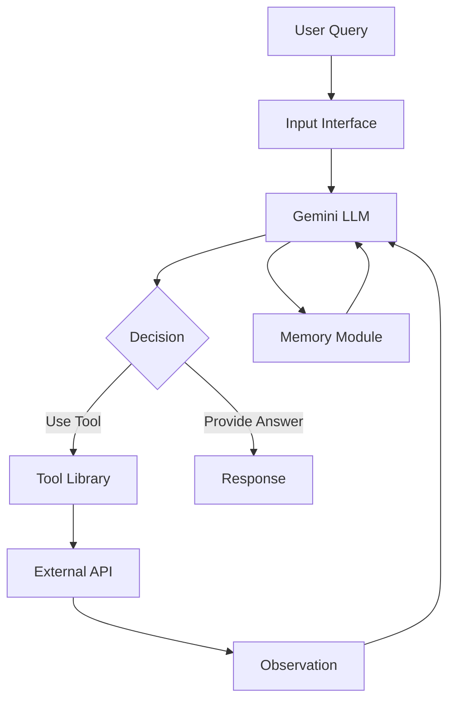
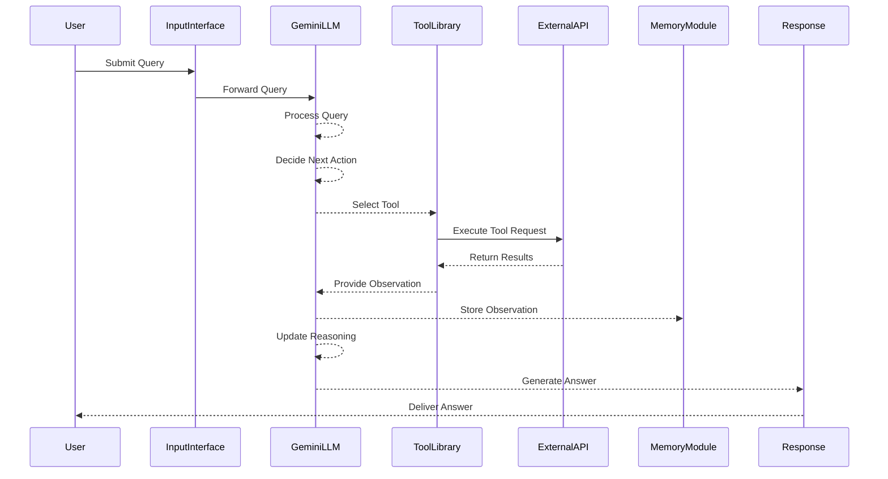

# Technical Specification: Building ReAct Agents from Scratch Using Gemini

## Table of Contents

1. [Introduction](#introduction)
    - [Purpose](#purpose)
    - [Scope](#scope)
    - [Definitions and Acronyms](#definitions-and-acronyms)
2. [System Overview](#system-overview)
    - [ReAct Framework](#react-framework)
    - [Key Features](#key-features)
3. [Architecture](#architecture)
    - [High-Level Architecture](#high-level-architecture)
    - [Component Diagram](#component-diagram)
    - [Sequence Diagram](#sequence-diagram)
4. [Detailed Design](#detailed-design)
    - [Environment Setup](#environment-setup)
    - [Agent Structure](#agent-structure)
        - [Enums and Custom Types](#enums-and-custom-types)
        - [Message and Choice Models](#message-and-choice-models)
        - [Tool Class](#tool-class)
        - [Agent Class](#agent-class)
    - [Think-Act-Observe Loop](#think-act-observe-loop)
        - [Think Method](#think-method)
        - [Decide Method](#decide-method)
        - [Act Method](#act-method)
    - [Prompt Template](#prompt-template)
5. [Implementation](#implementation)
    - [Directory Structure](#directory-structure)
    - [Code Examples](#code-examples)
        - [Enums and Custom Types (`enums.py`)](#enums-and-custom-types-enumspy)
        - [Message and Choice Models (`models.py`)](#message-and-choice-models-modelspy)
        - [Tool Class (`tool.py`)](#tool-class-toolpy)
        - [Agent Class (`agent.py`)](#agent-class-agentpy)
        - [Manager Class (`manager.py`)](#manager-class-managerpy)
    - [Mermaid Diagrams](#mermaid-diagrams)
        - [Component Diagram](#component-diagram-1)
        - [Sequence Diagram](#sequence-diagram-1)
6. [Usage](#usage)
    - [Running the Agent](#running-the-agent)
    - [Example Interactions](#example-interactions)
7. [Comparison with Traditional Approaches](#comparison-with-traditional-approaches)
8. [Testing](#testing)
    - [Unit Tests](#unit-tests)
    - [Integration Tests](#integration-tests)
    - [Example Test Cases](#example-test-cases)
9. [Deployment](#deployment)
    - [Prerequisites](#prerequisites)
    - [Deployment Steps](#deployment-steps)
10. [Future Enhancements](#future-enhancements)
11. [References](#references)
12. [Appendix](#appendix)
    - [Complete Code Listings](#complete-code-listings)
    - [Mermaid Diagram Generator Tools](#mermaid-diagram-generator-tools)

---

## Introduction

### Purpose

This specification document outlines the design and implementation of ReAct (Reasoning and Acting) agents using the Gemini large language model (LLM). The goal is to provide a comprehensive guide for developers to build, understand, and extend ReAct-based AI agents capable of dynamic reasoning, tool utilization, and iterative problem-solving.

### Scope

The document covers the following aspects:

- Conceptual understanding of ReAct agents.
- Architectural design and component interactions.
- Step-by-step implementation using Python.
- Code examples and Mermeid diagrams.
- Comparison with traditional AI agent approaches.
- Testing and deployment strategies.
- Future directions for enhancing ReAct agents.

### Definitions and Acronyms

| Term         | Definition                                                                 |
|--------------|----------------------------------------------------------------------------|
| AI           | Artificial Intelligence                                                     |
| LLM          | Large Language Model                                                       |
| ReAct        | Reasoning and Acting                                                        |
| API          | Application Programming Interface                                          |
| NLP          | Natural Language Processing                                                |
| NLU          | Natural Language Understanding                                             |
| JSON         | JavaScript Object Notation                                                  |
| UML          | Unified Modeling Language                                                  |
| CI/CD        | Continuous Integration/Continuous Deployment                              |
| SERP         | Search Engine Results Page                                                 |
| DAC         | Design Automation Conference                                               |
| CIKM         | ACM International Conference on Information and Knowledge Management      |
| ICTAI        | IEEE International Conference on Tools with Artificial Intelligence        |

## System Overview

### ReAct Framework

ReAct (Reasoning and Acting) is a unified framework for building AI agents that seamlessly integrate reasoning and decision-making with task execution. Unlike traditional AI systems that separate reasoning and action, ReAct agents use LLMs to concurrently process observations, generate plans, and execute actions in an iterative loop.

### Key Features

1. **Unified Reasoning and Acting**: Combines thought processes and actions within a single system facilitated by LLMs.
2. **Dynamic Tool Utilization**: Selects and employs various external tools and APIs based on the current context and objectives.
3. **Iterative Problem Solving**: Engages in a continuous cycle of reasoning, action, and observation to refine strategies and move towards solutions.
4. **Memory Integration**: Maintains a historical context to inform decision-making and avoid redundant actions.

## Architecture

### High-Level Architecture

The ReAct agent architecture consists of the following primary components:

- **Input Interface**: Receives user queries in natural language.
- **Language Model (Gemini)**: Serves as the core reasoning and decision-making unit.
- **Tool Library**: Contains various tools (e.g., Google Search, Wikipedia) accessible via APIs.
- **Memory Module**: Stores historical interactions and observations.
- **Feedback Loop**: Facilitates iterative reasoning and action cycles.

### Component Diagram



### Sequence Diagram



## Detailed Design

### Environment Setup

1. **Programming Language**: Python 3.8+
2. **Dependencies**:
    - `pydantic` for data validation.
    - `requests` for API calls.
    - `logging` for logging activities.
3. **Directory Structure**:
    ```
    react-agent/
    ├── src/
    │   ├── react/
    │   │   ├── agent.py
    │   │   ├── enums.py
    │   │   ├── models.py
    │   │   └── manager.py
    │   ├── tools/
    │   │   ├── serp.py
    │   │   └── wiki.py
    │   └── utils/
    │       └── logger.py
    ├── tests/
    │   ├── test_agent.py
    │   ├── test_tools.py
    │   └── ...
    ├── requirements.txt
    └── README.md
    ```

### Agent Structure

#### Enums and Custom Types

```python
# src/react/enums.py
from enum import Enum, auto
from typing import Union

class Name(Enum):
    """Enumeration for tool names available to the agent."""
    WIKIPEDIA = auto()
    GOOGLE = auto()
    NONE = auto()

    def __str__(self) -> str:
        return self.name.lower()

Observation = Union[str, Exception]
```

#### Message and Choice Models

```python
# src/react/models.py
from pydantic import BaseModel, Field

class Message(BaseModel):
    role: str = Field(..., description="The role of the message sender.")
    content: str = Field(..., description="The content of the message.")

class Choice(BaseModel):
    name: Name = Field(..., description="The name of the tool chosen.")
    reason: str = Field(..., description="The reason for choosing this tool.")
```

#### Tool Class

```python
# src/react/tool.py
import logging
from typing import Callable
from .enums import Name, Observation

logger = logging.getLogger(__name__)

class Tool:
    def __init__(self, name: Name, func: Callable[[str], str]):
        self.name = name
        self.func = func

    def use(self, query: str) -> Observation:
        try:
            return self.func(query)
        except Exception as e:
            logger.error(f"Error executing tool {self.name}: {e}")
            return str(e)
```

#### Agent Class

```python
# src/react/agent.py
import json
import logging
from typing import Callable, Dict, List
from .enums import Name, Observation
from .models import Message, Choice
from .tool import Tool

logger = logging.getLogger(__name__)

class GenerativeModel:
    """Placeholder for the Gemini or any other LLM."""
    def generate(self, prompt: str) -> str:
        # Integration with Gemini model to generate response
        pass

class Agent:
    def __init__(self, model: GenerativeModel) -> None:
        self.model = model
        self.tools: Dict[Name, Tool] = {}
        self.messages: List[Message] = []
        self.query = ""
        self.max_iterations = 5
        self.current_iteration = 0
        self.prompt_template = self.load_template()

    def load_template(self) -> str:
        return """
        You are a ReAct (Reasoning and Acting) agent tasked with answering the following query:

        Query: {query}

        Your goal is to reason about the query and decide on the best course of action to answer it accurately.

        Previous reasoning steps and observations: {history}

        Available tools: {tools}

        Instructions:
        1. Analyze the query, previous reasoning steps, and observations.
        2. Decide on the next action: use a tool or provide a final answer.
        3. Respond in the following JSON format:

        If you need to use a tool:
        {{
            "thought": "Your detailed reasoning about what to do next",
            "action": {{
                "name": "Tool name (wikipedia, google, or none)",
                "reason": "Explanation of why you chose this tool",
                "input": "Specific input for the tool, if different from the original query"
            }}
        }}

        If you have enough information to answer the query:
        {{
            "thought": "Your final reasoning process",
            "answer": "Your comprehensive answer to the query"
        }}

        Remember:
        - Be thorough in your reasoning.
        - Use tools when you need more information.
        - Always base your reasoning on the actual observations from tool use.
        - If a tool returns no results or fails, acknowledge this and consider using a different tool or approach.
        - Provide a final answer only when you're confident you have sufficient information.
        - If you cannot find the necessary information after using available tools, admit that you don't have enough information to answer the query confidently.
        """

    def register(self, name: Name, func: Callable[[str], str]) -> None:
        self.tools[name] = Tool(name, func)

    def trace(self, role: str, content: str) -> None:
        self.messages.append(Message(role=role, content=content))

    def get_history(self) -> str:
        return "\n".join([f"{msg.role}: {msg.content}" for msg in self.messages])

    def think(self) -> None:
        self.current_iteration += 1
        if self.current_iteration > self.max_iterations:
            logger.warning("Reached maximum iterations. Stopping.")
            return
        prompt = self.prompt_template.format(
            query=self.query, 
            history=self.get_history(),
            tools=', '.join([str(tool.name) for tool in self.tools.values()])
        )
        response = self.ask_gemini(prompt)
        self.trace("assistant", f"Thought: {response}")
        self.decide(response)

    def decide(self, response: str) -> None:
        try:
            parsed_response = json.loads(response.strip().strip('`').strip())
            if "action" in parsed_response:
                action = parsed_response["action"]
                tool_name = Name[action["name"].upper()]
                self.act(tool_name, action.get("input", self.query))
            elif "answer" in parsed_response:
                self.trace("assistant", f"Final Answer: {parsed_response['answer']}")
            else:
                raise ValueError("Invalid response format")
        except Exception as e:
            logger.error(f"Error processing response: {str(e)}")
            self.think()

    def act(self, tool_name: Name, query: str) -> None:
        tool = self.tools.get(tool_name)
        if tool:
            result = tool.use(query)
            observation = f"Observation from {tool_name}: {result}"
            self.trace("system", observation)
            self.think()
        else:
            logger.error(f"No tool registered for choice: {tool_name}")
            self.think()

    def execute(self, query: str) -> str:
        self.query = query
        self.think()
        final_answers = [msg.content for msg in self.messages if msg.role == "assistant" and "Final Answer" in msg.content]
        return final_answers[-1].split("Final Answer: ")[-1] if final_answers else "Unable to provide an answer."

    def ask_gemini(self, prompt: str) -> str:
        return self.model.generate(prompt)
```

### Think-Act-Observe Loop

#### Think Method

```python
def think(self) -> None:
    self.current_iteration += 1
    if self.current_iteration > self.max_iterations:
        logger.warning("Reached maximum iterations. Stopping.")
        return
    prompt = self.prompt_template.format(
        query=self.query, 
        history=self.get_history(),
        tools=', '.join([str(tool.name) for tool in self.tools.values()])
    )
    response = self.ask_gemini(prompt)
    self.trace("assistant", f"Thought: {response}")
    self.decide(response)
```

#### Decide Method

```python
def decide(self, response: str) -> None:
    try:
        parsed_response = json.loads(response.strip().strip('`').strip())
        if "action" in parsed_response:
            action = parsed_response["action"]
            tool_name = Name[action["name"].upper()]
            self.act(tool_name, action.get("input", self.query))
        elif "answer" in parsed_response:
            self.trace("assistant", f"Final Answer: {parsed_response['answer']}")
        else:
            raise ValueError("Invalid response format")
    except Exception as e:
        logger.error(f"Error processing response: {str(e)}")
        self.think()
```

#### Act Method

```python
def act(self, tool_name: Name, query: str) -> None:
    tool = self.tools.get(tool_name)
    if tool:
        result = tool.use(query)
        observation = f"Observation from {tool_name}: {result}"
        self.trace("system", observation)
        self.think()
    else:
        logger.error(f"No tool registered for choice: {tool_name}")
        self.think()
```

### Prompt Template

```python
def load_template(self) -> str:
    return """
    You are a ReAct (Reasoning and Acting) agent tasked with answering the following query:

    Query: {query}

    Your goal is to reason about the query and decide on the best course of action to answer it accurately.

    Previous reasoning steps and observations: {history}

    Available tools: {tools}

    Instructions:
    1. Analyze the query, previous reasoning steps, and observations.
    2. Decide on the next action: use a tool or provide a final answer.
    3. Respond in the following JSON format:

    If you need to use a tool:
    {{
        "thought": "Your detailed reasoning about what to do next",
        "action": {{
            "name": "Tool name (wikipedia, google, or none)",
            "reason": "Explanation of why you chose this tool",
            "input": "Specific input for the tool, if different from the original query"
        }}
    }}

    If you have enough information to answer the query:
    {{
        "thought": "Your final reasoning process",
        "answer": "Your comprehensive answer to the query"
    }}

    Remember:
    - Be thorough in your reasoning.
    - Use tools when you need more information.
    - Always base your reasoning on the actual observations from tool use.
    - If a tool returns no results or fails, acknowledge this and consider using a different tool or approach.
    - Provide a final answer only when you're confident you have sufficient information.
    - If you cannot find the necessary information after using available tools, admit that you don't have enough information to answer the query confidently.
    You can find the prompt template in the shared repo here.
    """
```

## Implementation

### Directory Structure

```plaintext
react-agent/
├── src/
│   ├── react/
│   │   ├── agent.py
│   │   ├── enums.py
│   │   ├── models.py
│   │   └── manager.py
│   ├── tools/
│   │   ├── serp.py
│   │   └── wiki.py
│   └── utils/
│       └── logger.py
├── tests/
│   ├── test_agent.py
│   ├── test_tools.py
│   └── ...
├── requirements.txt
└── README.md
```

### Code Examples

#### Enums and Custom Types (`enums.py`)

```python
# src/react/enums.py
from enum import Enum, auto
from typing import Union

class Name(Enum):
    """Enumeration for tool names available to the agent."""
    WIKIPEDIA = auto()
    GOOGLE = auto()
    NONE = auto()

    def __str__(self) -> str:
        return self.name.lower()

Observation = Union[str, Exception]
```

#### Message and Choice Models (`models.py`)

```python
# src/react/models.py
from pydantic import BaseModel, Field
from .enums import Name

class Message(BaseModel):
    role: str = Field(..., description="The role of the message sender.")
    content: str = Field(..., description="The content of the message.")

class Choice(BaseModel):
    name: Name = Field(..., description="The name of the tool chosen.")
    reason: str = Field(..., description="The reason for choosing this tool.")
```

#### Tool Class (`tool.py`)

```python
# src/react/tool.py
import logging
from typing import Callable
from .enums import Name, Observation

logger = logging.getLogger(__name__)

class Tool:
    def __init__(self, name: Name, func: Callable[[str], str]):
        self.name = name
        self.func = func

    def use(self, query: str) -> Observation:
        try:
            return self.func(query)
        except Exception as e:
            logger.error(f"Error executing tool {self.name}: {e}")
            return str(e)
```

#### Agent Class (`agent.py`)

```python
# src/react/agent.py
import json
import logging
from typing import Callable, Dict, List
from .enums import Name, Observation
from .models import Message, Choice
from .tool import Tool

logger = logging.getLogger(__name__)

class GenerativeModel:
    """Placeholder for the Gemini or any other LLM."""
    def generate(self, prompt: str) -> str:
        # Integration with Gemini model to generate response
        pass

class Agent:
    def __init__(self, model: GenerativeModel) -> None:
        self.model = model
        self.tools: Dict[Name, Tool] = {}
        self.messages: List[Message] = []
        self.query = ""
        self.max_iterations = 5
        self.current_iteration = 0
        self.prompt_template = self.load_template()

    def load_template(self) -> str:
        return """
        You are a ReAct (Reasoning and Acting) agent tasked with answering the following query:

        Query: {query}

        Your goal is to reason about the query and decide on the best course of action to answer it accurately.

        Previous reasoning steps and observations: {history}

        Available tools: {tools}

        Instructions:
        1. Analyze the query, previous reasoning steps, and observations.
        2. Decide on the next action: use a tool or provide a final answer.
        3. Respond in the following JSON format:

        If you need to use a tool:
        {{
            "thought": "Your detailed reasoning about what to do next",
            "action": {{
                "name": "Tool name (wikipedia, google, or none)",
                "reason": "Explanation of why you chose this tool",
                "input": "Specific input for the tool, if different from the original query"
            }}
        }}

        If you have enough information to answer the query:
        {{
            "thought": "Your final reasoning process",
            "answer": "Your comprehensive answer to the query"
        }}

        Remember:
        - Be thorough in your reasoning.
        - Use tools when you need more information.
        - Always base your reasoning on the actual observations from tool use.
        - If a tool returns no results or fails, acknowledge this and consider using a different tool or approach.
        - Provide a final answer only when you're confident you have sufficient information.
        - If you cannot find the necessary information after using available tools, admit that you don't have enough information to answer the query confidently.
        You can find the prompt template in the shared repo here.
        """

    def register(self, name: Name, func: Callable[[str], str]) -> None:
        self.tools[name] = Tool(name, func)

    def trace(self, role: str, content: str) -> None:
        self.messages.append(Message(role=role, content=content))

    def get_history(self) -> str:
        return "\n".join([f"{msg.role}: {msg.content}" for msg in self.messages])

    def think(self) -> None:
        self.current_iteration += 1
        if self.current_iteration > self.max_iterations:
            logger.warning("Reached maximum iterations. Stopping.")
            return
        prompt = self.prompt_template.format(
            query=self.query, 
            history=self.get_history(),
            tools=', '.join([str(tool.name) for tool in self.tools.values()])
        )
        response = self.ask_gemini(prompt)
        self.trace("assistant", f"Thought: {response}")
        self.decide(response)

    def decide(self, response: str) -> None:
        try:
            parsed_response = json.loads(response.strip().strip('`').strip())
            if "action" in parsed_response:
                action = parsed_response["action"]
                tool_name = Name[action["name"].upper()]
                self.act(tool_name, action.get("input", self.query))
            elif "answer" in parsed_response:
                self.trace("assistant", f"Final Answer: {parsed_response['answer']}")
            else:
                raise ValueError("Invalid response format")
        except Exception as e:
            logger.error(f"Error processing response: {str(e)}")
            self.think()

    def act(self, tool_name: Name, query: str) -> None:
        tool = self.tools.get(tool_name)
        if tool:
            result = tool.use(query)
            observation = f"Observation from {tool_name}: {result}"
            self.trace("system", observation)
            self.think()
        else:
            logger.error(f"No tool registered for choice: {tool_name}")
            self.think()

    def execute(self, query: str) -> str:
        self.query = query
        self.think()
        final_answers = [msg.content for msg in self.messages if msg.role == "assistant" and "Final Answer" in msg.content]
        return final_answers[-1].split("Final Answer: ")[-1] if final_answers else "Unable to provide an answer."

    def ask_gemini(self, prompt: str) -> str:
        return self.model.generate(prompt)
```

#### Manager Class (`manager.py`)

```python
# src/react/manager.py
from typing import Callable, Dict
from .enums import Name
from .tool import Tool
from .models import Choice

class Manager:
    """
    Manages tool registration, selection, and execution.
    """
    def __init__(self) -> None:
        self.tools: Dict[Name, Tool] = {} 

    def register(self, name: Name, func: Callable[[str], str]) -> None:
        """
        Register a new tool.
        """
        self.tools[name] = Tool(name, func)

    def act(self, name: Name, query: str) -> str:
        """
        Retrieve and use a registered tool to process the given query.

        Parameters:
            name (Name): The name of the tool to use.
            query (str): The input query string.

        Returns:
            str: The result of the tool's execution or an error message.
        """
        if name not in self.tools:
            raise ValueError(f"Tool {name} not registered")
        
        processed_query = query.split(' ', 1)[1] if ' ' in query else query
        return self.tools[name].use(processed_query)

    def choose(self, query: str) -> Choice:
        """
        Choose the appropriate tool based on the query prefix.
        """
        if query.startswith("/people"):
            return Choice(
                name=Name.WIKIPEDIA, 
                reason="Query starts with /people, using Wikipedia for biographical information."
            )
        elif query.startswith("/location"):
            return Choice(
                name=Name.GOOGLE, 
                reason="Query starts with /location, using Google for location-specific information."
            )
        else:
            raise ValueError("Unsupported query. Use /people or /location prefix.")
```

### Mermaid Diagrams

#### Component Diagram


#### Sequence Diagram


## Usage

### Running the Agent

1. **Clone the Repository**

    ```bash
    git clone https://github.com/yourusername/react-agent.git
    cd react-agent
    ```

2. **Install Dependencies**

    ```bash
    pip install -r requirements.txt
    ```

3. **Set Up API Keys**

    - **SERP API**: Obtain an API key from [SERP API](https://serpapi.com/).
    - **Wikipedia API**: No API key required.

    Set the API keys as environment variables:

    ```bash
    export SERP_API_KEY='your_serp_api_key'
    ```

4. **Run the Agent**

    ```bash
    python src/react/agent.py
    ```

### Example Interactions

#### Example 1: Simple Age Comparison

**Query**: Who is older, Cristiano Ronaldo or Lionel Messi?

**Agent Trace**:

```
Thought: {
 "thought": "The query asks for a comparison of age between Cristiano Ronaldo and Lionel Messi. To determine who is older, I need to find their birth dates and compare.",
 "action": {
  "name": "wikipedia",
  "reason": "Wikipedia is a reliable source for biographical information, including birth dates of famous individuals.",
  "input": "Cristiano Ronaldo"
 }
}

Observation from wikipedia: [Wikipedia summary for Cristiano Ronaldo, including his birth date: February 5, 1985]

Thought: {
 "thought": "I have found Cristiano Ronaldo's birth date from Wikipedia: February 5, 1985. Now I need to find Lionel Messi's birth date to compare and determine who is older.",
 "action": {
  "name": "wikipedia",
  "reason": "Wikipedia is a reliable source for biographical information, and I need to find Lionel Messi's birth date to compare with Cristiano Ronaldo's.",
  "input": "Lionel Messi"
 }
}

Observation from wikipedia: [Wikipedia summary for Lionel Messi, including his birth date: June 24, 1987]

Thought: {
 "thought": "I now have Cristiano Ronaldo's birth date (February 5, 1985) and Lionel Messi's birth date (June 24, 1987) from Wikipedia. I can compare these dates to determine who is older.",
 "answer": "Cristiano Ronaldo is older than Lionel Messi. Ronaldo was born on February 5, 1985, while Messi was born on June 24, 1987."
}
```

**Final Answer**: Cristiano Ronaldo is older than Lionel Messi. Ronaldo was born on February 5, 1985, while Messi was born on June 24, 1987.

#### Example 2: Multi-Step Research Query

**Query**: What is the average temperature in the capital city of the country where the current FIFA World Cup champion’s team captain was born?

**Agent Trace**:

*(Refer to the detailed example in the source content for a step-by-step trace.)*

**Final Answer**: The average temperature in the capital city of the country where the current FIFA World Cup champion's team captain was born is approximately 18°C (64°F). This refers to Buenos Aires, Argentina, the birthplace of Lionel Messi.

## Comparison with Traditional Approaches

Traditional AI systems typically rely on predefined rules or pattern matching to select tools and process queries. For example, a rule-based manager might route `/people` queries to Wikipedia and `/location` queries to Google. While effective for straightforward tasks, this approach lacks flexibility and requires manual updates to integrate new tools or handle complex queries.

**Advantages of ReAct Framework**:

- **Dynamic Tool Selection**: Utilizes LLMs to analyze context and select appropriate tools on-the-fly.
- **Iterative Reasoning**: Engages in a feedback loop to refine actions based on observations.
- **Scalability**: Easily incorporates new tools without modifying existing rule-based logic.
- **Adaptive Behavior**: Handles complex, multi-step tasks by dynamically adjusting strategies.

**Example Comparison**:

*Traditional Approach*:

```python
class Manager:
    def choose(self, query: str) -> Choice:
        if query.startswith("/people"):
            return Choice(
                name=Name.WIKIPEDIA, 
                reason="Query starts with /people, using Wikipedia for biographical information."
            )
        elif query.startswith("/location"):
            return Choice(
                name=Name.GOOGLE, 
                reason="Query starts with /location, using Google for location-specific information."
            )
        else:
            raise ValueError("Unsupported query. Use /people or /location prefix.")
```

*ReAct Framework* leverages LLM for dynamic decisions without rigid prefixes, enhancing flexibility and robustness.

## Testing

### Unit Tests

- **Objective**: Verify individual components (e.g., Tool classes, enums).
- **Tools**: `unittest`, `pytest`.

```python
# tests/test_tool.py
import unittest
from src.react.enums import Name
from src.react.tool import Tool

def mock_wikipedia(query):
    if query == "Cristiano Ronaldo":
        return "Cristiano Ronaldo was born on February 5, 1985."
    else:
        raise ValueError("Not found")

class TestTool(unittest.TestCase):
    def test_tool_use_success(self):
        tool = Tool(Name.WIKIPEDIA, mock_wikipedia)
        result = tool.use("Cristiano Ronaldo")
        self.assertEqual(result, "Cristiano Ronaldo was born on February 5, 1985.")

    def test_tool_use_failure(self):
        tool = Tool(Name.WIKIPEDIA, mock_wikipedia)
        result = tool.use("Unknown Person")
        self.assertIsInstance(result, str)
        self.assertIn("Not found", result)

if __name__ == '__main__':
    unittest.main()
```

### Integration Tests

- **Objective**: Test interactions between components (e.g., Agent and Tool Library).
- **Example**: Simulate a complete query and verify the response.

```python
# tests/test_agent.py
import unittest
from src.react.agent import Agent, GenerativeModel
from src.react.enums import Name

class MockModel(GenerativeModel):
    def generate(self, prompt: str) -> str:
        # Mock response based on the prompt
        if "Cristiano Ronaldo" in prompt:
            return json.dumps({
                "action": {
                    "name": "wikipedia",
                    "reason": "Need birth date information from Wikipedia.",
                    "input": "Cristiano Ronaldo"
                }
            })
        elif "Lionel Messi" in prompt:
            return json.dumps({
                "action": {
                    "name": "wikipedia",
                    "reason": "Need birth date information from Wikipedia.",
                    "input": "Lionel Messi"
                }
            })
        else:
            return json.dumps({
                "answer": "Cristiano Ronaldo is older than Lionel Messi. Ronaldo was born on February 5, 1985, while Messi was born on June 24, 1987."
            })

class TestAgent(unittest.TestCase):
    def test_execute_agent(self):
        model = MockModel()
        agent = Agent(model)
        agent.register(Name.WIKIPEDIA, lambda q: "Birth date")
        answer = agent.execute("Who is older, Cristiano Ronaldo or Lionel Messi?")
        self.assertEqual(answer, "Cristiano Ronaldo is older than Lionel Messi. Ronaldo was born on February 5, 1985, while Messi was born on June 24, 1987.")

if __name__ == '__main__':
    unittest.main()
```

### Example Test Cases

1. **Simple Query**: Validate correct comparison between two individuals' ages.
2. **Tool Failure**: Simulate tool failure and ensure the agent retries or handles gracefully.
3. **Complex Query**: Test multi-step reasoning and tool utilization.
4. **Unsupported Query**: Ensure the agent admits inability to answer appropriately.

## Deployment

### Prerequisites

- Python 3.8+
- API keys for SERP API (Google Search)
- Access to Gemini LLM or equivalent

### Deployment Steps

1. **Containerization** (Optional):
    - Use Docker to containerize the application for consistent deployment.
    
    ```Dockerfile
    FROM python:3.8-slim

    WORKDIR /app

    COPY requirements.txt .
    RUN pip install --no-cache-dir -r requirements.txt

    COPY . .

    CMD ["python", "src/react/agent.py"]
    ```

2. **Environment Variables**:
    - Securely store API keys using environment variables or secret managers.

3. **Continuous Integration/Continuous Deployment (CI/CD)**:
    - Set up CI/CD pipelines using tools like GitHub Actions, Jenkins, or GitLab CI to automate testing and deployment.

4. **Monitoring and Logging**:
    - Implement monitoring tools (e.g., Prometheus, Grafana) to track agent performance.
    - Ensure logging is properly configured for debugging and audit trails.

5. **Scalability**:
    - Deploy on scalable platforms such as Google Cloud, AWS, or Kubernetes clusters to handle varying loads.

## Future Enhancements

1. **Multi-Agent Collaboration**:
    - Develop a hierarchy of agents where primary agents delegate tasks to specialized sub-agents.
    - Implement communication protocols for agents to share observations and collaborate on complex tasks.

2. **Multi-Modal Data Processing**:
    - Integrate capabilities to process images, audio, and video for richer interactions and decision-making.

3. **Enhanced Memory Management**:
    - Develop advanced memory modules to better handle long-term context and knowledge retention.

4. **Security and Compliance**:
    - Implement robust security measures to protect data and ensure compliance with regulations.

5. **User Customization**:
    - Allow users to customize agent behaviors, tool integrations, and reasoning patterns based on specific needs.

## References

- [ReAct: Synergizing Reasoning and Acting in Language Models](https://example.com/react-paper)
- [SERP API Documentation](https://serpapi.com/)
- [Wikipedia API Documentation](https://www.mediawiki.org/wiki/API:Main_page)
- [Google Cloud Vertex AI](https://cloud.google.com/vertex-ai)
- [Mermaid Diagram Syntax](https://mermaid-js.github.io/mermaid/#/)

## Appendix

### Complete Code Listings

*(Provide links to GitHub repository or include full code in separate documents.)*

### Mermaid Diagram Generator Tools

- [Mermaid Live Editor](https://mermaid.live/)
- [VS Code Mermaid Preview Extension](https://marketplace.visualstudio.com/items?itemName=vstirbu.vscode-mermaid-preview)

---

## Conclusion

This technical specification serves as a comprehensive guide for building ReAct agents using the Gemini LLM. By following the outlined architecture, design principles, and implementation steps, developers can create sophisticated AI agents capable of dynamic reasoning, tool utilization, and iterative problem-solving. The ReAct framework's integration of reasoning and acting within an LLM-centric architecture offers significant advantages over traditional AI systems, paving the way for more adaptable and intelligent agents.
