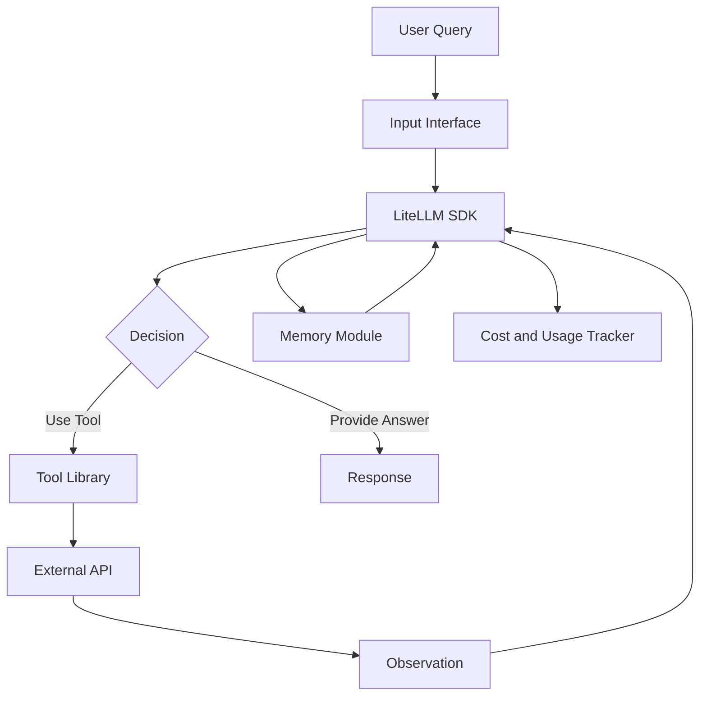
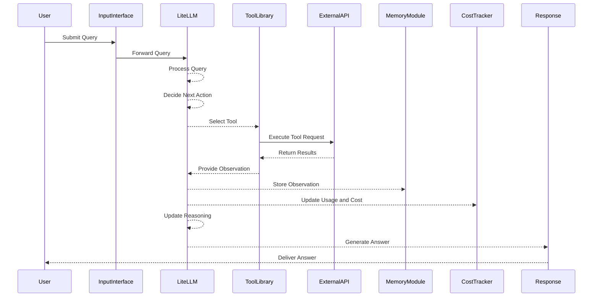

# Technical Specification: Building ReAct Agents from Scratch Using LiteLLM

## Table of Contents

1. [Introduction](#introduction)
    - [Purpose](#purpose)
    - [Scope](#scope)
    - [Definitions and Acronyms](#definitions-and-acronyms)
2. [System Overview](#system-overview)
    - [ReAct Framework](#react-framework)
    - [Key Features](#key-features)
3. [Architecture](#architecture)
    - [High-Level Architecture](#high-level-architecture)
    - [Component Diagram](#component-diagram)
    - [Sequence Diagram](#sequence-diagram)
4. [Detailed Design](#detailed-design)
    - [Environment Setup](#environment-setup)
    - [Agent Structure](#agent-structure)
        - [Enums and Custom Types](#enums-and-custom-types)
        - [Message and Choice Models](#message-and-choice-models)
        - [Tool Class](#tool-class)
        - [Agent Class](#agent-class)
    - [Think-Act-Observe Loop](#think-act-observe-loop)
        - [Think Method](#think-method)
        - [Decide Method](#decide-method)
        - [Act Method](#act-method)
    - [Prompt Template](#prompt-template)
5. [Implementation](#implementation)
    - [Directory Structure](#directory-structure)
    - [Code Examples](#code-examples)
        - [Enums and Custom Types (`enums.py`)](#enums-and-custom-types-enumspy)
        - [Message and Choice Models (`models.py`)](#message-and-choice-models-modelspy)
        - [Tool Class (`tool.py`)](#tool-class-toolpy)
        - [Agent Class (`agent.py`)](#agent-class-agentpy)
        - [Manager Class (`manager.py`)](#manager-class-managerpy)
    - [Mermaid Diagrams](#mermaid-diagrams)
        - [Component Diagram](#component-diagram-1)
        - [Sequence Diagram](#sequence-diagram-1)
6. [Usage](#usage)
    - [Running the Agent](#running-the-agent)
    - [Example Interactions](#example-interactions)
7. [Comparison with Traditional Approaches](#comparison-with-traditional-approaches)
8. [Testing](#testing)
    - [Unit Tests](#unit-tests)
    - [Integration Tests](#integration-tests)
    - [Example Test Cases](#example-test-cases)
9. [Deployment](#deployment)
    - [Prerequisites](#prerequisites)
    - [Deployment Steps](#deployment-steps)
10. [Future Enhancements](#future-enhancements)
11. [References](#references)
12. [Appendix](#appendix)
    - [Complete Code Listings](#complete-code-listings)
    - [Mermaid Diagram Generator Tools](#mermaid-diagram-generator-tools)

---

## Introduction

### Purpose

This specification document outlines the design and implementation of ReAct (Reasoning and Acting) agents using LiteLLM, a Python SDK and Proxy Server that provides a unified interface to interact with over 100 Large Language Models (LLMs) using an OpenAI-compatible API. The goal is to provide a comprehensive guide for developers to build, understand, and extend ReAct-based AI agents capable of dynamic reasoning, tool utilization, and iterative problem-solving.

### Scope

The document covers the following aspects:

- Conceptual understanding of ReAct agents.
- Architectural design and component interactions.
- Step-by-step implementation using Python and LiteLLM.
- Code examples and Mermaid diagrams.
- Comparison with traditional AI agent approaches.
- Testing and deployment strategies.
- Future directions for enhancing ReAct agents.

### Definitions and Acronyms

| Term         | Definition                                                                 |
|--------------|----------------------------------------------------------------------------|
| AI           | Artificial Intelligence                                                     |
| LLM          | Large Language Model                                                       |
| ReAct        | Reasoning and Acting                                                        |
| API          | Application Programming Interface                                          |
| NLP          | Natural Language Processing                                                |
| NLU          | Natural Language Understanding                                             |
| JSON         | JavaScript Object Notation                                                  |
| UML          | Unified Modeling Language                                                  |
| CI/CD        | Continuous Integration/Continuous Deployment                              |
| SERP         | Search Engine Results Page                                                 |
| SDK          | Software Development Kit                                                   |
| API Gateway  | A server that acts as an API front-end, receiving API requests            |
| HTTP         | HyperText Transfer Protocol                                                |

## System Overview

### ReAct Framework

ReAct (Reasoning and Acting) is a unified framework for building AI agents that seamlessly integrate reasoning and decision-making with task execution. Unlike traditional AI systems that separate reasoning and action, ReAct agents use Large Language Models (LLMs) to concurrently process observations, generate plans, and execute actions in an iterative loop. By leveraging LiteLLM, ReAct agents can interact with a diverse set of LLMs through a consistent and scalable API, enhancing their flexibility and capabilities.

### Key Features

1. **Unified Reasoning and Acting**: Combines thought processes and actions within a single system facilitated by LiteLLM.
2. **Dynamic Tool Utilization**: Selects and employs various external tools and APIs based on the current context and objectives.
3. **Iterative Problem Solving**: Engages in a continuous cycle of reasoning, action, and observation to refine strategies and move towards solutions.
4. **Memory Integration**: Maintains a historical context to inform decision-making and avoid redundant actions.
5. **Model Flexibility**: Access over 100+ LLMs via LiteLLM, allowing easy switching and fallback between models.
6. **Cost and Usage Tracking**: Monitors API usage and costs across multiple projects and models.
7. **Extensible Architecture**: Easily integrates new tools and models without major architectural changes.

## Architecture

### High-Level Architecture

The ReAct agent architecture utilizing LiteLLM consists of the following primary components:

- **Input Interface**: Receives user queries in natural language.
- **LiteLLM SDK**: Serves as the core interface for interacting with multiple LLMs.
- **Tool Library**: Contains various tools (e.g., Google Search, Wikipedia) accessible via APIs.
- **Memory Module**: Stores historical interactions and observations.
- **Feedback Loop**: Facilitates iterative reasoning and action cycles.
- **Cost and Usage Tracker**: Monitors API usage and expenses across different models and projects.

### Component Diagram



### Sequence Diagram



## Detailed Design

### Environment Setup

1. **Programming Language**: Python 3.8+
2. **Dependencies**:
    - `litellm` for interacting with LLMs.
    - `pydantic` for data validation.
    - `requests` for API calls.
    - `dotenv` for environment variable management.
    - `logging` for logging activities.
3. **Directory Structure**:
    ```
    react-agent/
    ├── src/
    │   ├── react/
    │   │   ├── agent.py
    │   │   ├── enums.py
    │   │   ├── models.py
    │   │   └── manager.py
    │   ├── tools/
    │   │   ├── serp.py
    │   │   └── wiki.py
    │   └── utils/
    │       └── logger.py
    ├── tests/
    │   ├── test_agent.py
    │   ├── test_tools.py
    │   └── ...
    ├── requirements.txt
    └── README.md
    ```

### Agent Structure

#### Enums and Custom Types

```python
# src/react/enums.py
from enum import Enum, auto
from typing import Union

class Name(Enum):
    """Enumeration for tool names available to the agent."""
    WIKIPEDIA = auto()
    GOOGLE = auto()
    SERPAPI = auto()
    NONE = auto()

    def __str__(self) -> str:
        return self.name.lower()

Observation = Union[str, Exception]
```

#### Message and Choice Models

```python
# src/react/models.py
from pydantic import BaseModel, Field
from .enums import Name

class Message(BaseModel):
    role: str = Field(..., description="The role of the message sender.")
    content: str = Field(..., description="The content of the message.")

class Choice(BaseModel):
    name: Name = Field(..., description="The name of the tool chosen.")
    reason: str = Field(..., description="The reason for choosing this tool.")
```

#### Tool Class

```python
# src/react/tool.py
import logging
from typing import Callable
from .enums import Name, Observation

logger = logging.getLogger(__name__)

class Tool:
    def __init__(self, name: Name, func: Callable[[str], str]):
        self.name = name
        self.func = func

    def use(self, query: str) -> Observation:
        try:
            return self.func(query)
        except Exception as e:
            logger.error(f"Error executing tool {self.name}: {e}")
            return str(e)
```

#### Agent Class

```python
# src/react/agent.py
import json
import logging
from typing import Callable, Dict, List
from .enums import Name, Observation
from .models import Message, Choice
from .tool import Tool
from litellm import completion

logger = logging.getLogger(__name__)

class GenerativeModel:
    """Placeholder for the LiteLLM interface."""
    def generate(self, prompt: str) -> str:
        # Integration with LiteLLM to generate response
        response = completion(
            model="gpt-4o-mini",
            messages=[{"role": "user", "content": prompt}]
        )
        return response.choices[0].message.content

class Agent:
    def __init__(self, model: GenerativeModel) -> None:
        self.model = model
        self.tools: Dict[Name, Tool] = {}
        self.messages: List[Message] = []
        self.query = ""
        self.max_iterations = 5
        self.current_iteration = 0
        self.prompt_template = self.load_template()

    def load_template(self) -> str:
        return """
        You are a ReAct (Reasoning and Acting) agent tasked with answering the following query:

        Query: {query}

        Your goal is to reason about the query and decide on the best course of action to answer it accurately.

        Previous reasoning steps and observations: {history}

        Available tools: {tools}

        Instructions:
        1. Analyze the query, previous reasoning steps, and observations.
        2. Decide on the next action: use a tool or provide a final answer.
        3. Respond in the following JSON format:

        If you need to use a tool:
        {{
            "thought": "Your detailed reasoning about what to do next",
            "action": {{
                "name": "Tool name (wikipedia, google, serpapi, or none)",
                "reason": "Explanation of why you chose this tool",
                "input": "Specific input for the tool, if different from the original query"
            }}
        }}

        If you have enough information to answer the query:
        {{
            "thought": "Your final reasoning process",
            "answer": "Your comprehensive answer to the query"
        }}

        Remember:
        - Be thorough in your reasoning.
        - Use tools when you need more information.
        - Always base your reasoning on the actual observations from tool use.
        - If a tool returns no results or fails, acknowledge this and consider using a different tool or approach.
        - Provide a final answer only when you're confident you have sufficient information.
        - If you cannot find the necessary information after using available tools, admit that you don't have enough information to answer the query confidently.
        """

    def register(self, name: Name, func: Callable[[str], str]) -> None:
        self.tools[name] = Tool(name, func)

    def trace(self, role: str, content: str) -> None:
        self.messages.append(Message(role=role, content=content))

    def get_history(self) -> str:
        return "\n".join([f"{msg.role}: {msg.content}" for msg in self.messages])

    def think(self) -> None:
        self.current_iteration += 1
        if self.current_iteration > self.max_iterations:
            logger.warning("Reached maximum iterations. Stopping.")
            return
        prompt = self.prompt_template.format(
            query=self.query, 
            history=self.get_history(),
            tools=', '.join([str(tool.name) for tool in self.tools.values()])
        )
        response = self.ask_litellm(prompt)
        self.trace("assistant", f"Thought: {response}")
        self.decide(response)

    def decide(self, response: str) -> None:
        try:
            parsed_response = json.loads(response.strip().strip('`').strip())
            if "action" in parsed_response:
                action = parsed_response["action"]
                tool_name_str = action["name"].upper()
                if tool_name_str not in Name.__members__:
                    raise ValueError(f"Unsupported tool: {tool_name_str}")
                tool_name = Name[tool_name_str]
                self.act(tool_name, action.get("input", self.query))
            elif "answer" in parsed_response:
                self.trace("assistant", f"Final Answer: {parsed_response['answer']}")
            else:
                raise ValueError("Invalid response format")
        except Exception as e:
            logger.error(f"Error processing response: {str(e)}")
            self.think()

    def act(self, tool_name: Name, query: str) -> None:
        tool = self.tools.get(tool_name)
        if tool:
            result = tool.use(query)
            observation = f"Observation from {tool_name}: {result}"
            self.trace("system", observation)
            self.think()
        else:
            logger.error(f"No tool registered for choice: {tool_name}")
            self.think()

    def execute(self, query: str) -> str:
        self.query = query
        self.think()
        final_answers = [msg.content for msg in self.messages if msg.role == "assistant" and "Final Answer" in msg.content]
        return final_answers[-1].split("Final Answer: ")[-1] if final_answers else "Unable to provide an answer."

    def ask_litellm(self, prompt: str) -> str:
        return self.model.generate(prompt)
```

#### Manager Class

```python
# src/react/manager.py
from typing import Callable, Dict
from .enums import Name
from .tool import Tool
from .models import Choice

class Manager:
    """
    Manages tool registration, selection, and execution.
    """
    def __init__(self) -> None:
        self.tools: Dict[Name, Tool] = {} 

    def register_tool(self, name: Name, func: Callable[[str], str]) -> None:
        """
        Register a new tool.
        """
        self.tools[name] = Tool(name, func)

    def act(self, name: Name, query: str) -> str:
        """
        Retrieve and use a registered tool to process the given query.

        Parameters:
            name (Name): The name of the tool to use.
            query (str): The input query string.

        Returns:
            str: The result of the tool's execution or an error message.
        """
        if name not in self.tools:
            raise ValueError(f"Tool {name} not registered")
        
        processed_query = query.split(' ', 1)[1] if ' ' in query else query
        return self.tools[name].use(processed_query)

    def choose_tool(self, query: str) -> Choice:
        """
        Choose the appropriate tool based on the query prefix.

        Example:
            Queries starting with "/people" use Wikipedia.
            Queries starting with "/search" use SerpApi.
        """
        if query.startswith("/people"):
            return Choice(
                name=Name.WIKIPEDIA, 
                reason="Query starts with /people, using Wikipedia for biographical information."
            )
        elif query.startswith("/search"):
            return Choice(
                name=Name.SERPAPI, 
                reason="Query starts with /search, using SerpApi for web search results."
            )
        elif query.startswith("/location"):
            return Choice(
                name=Name.GOOGLE, 
                reason="Query starts with /location, using Google for location-specific information."
            )
        else:
            return Choice(
                name=Name.NONE, 
                reason="Unsupported query prefix, unable to determine the appropriate tool."
            )
```

### Think-Act-Observe Loop

#### Think Method

```python
def think(self) -> None:
    self.current_iteration += 1
    if self.current_iteration > self.max_iterations:
        logger.warning("Reached maximum iterations. Stopping.")
        return
    prompt = self.prompt_template.format(
        query=self.query, 
        history=self.get_history(),
        tools=', '.join([str(tool.name) for tool in self.tools.values()])
    )
    response = self.ask_litellm(prompt)
    self.trace("assistant", f"Thought: {response}")
    self.decide(response)
```

#### Decide Method

```python
def decide(self, response: str) -> None:
    try:
        parsed_response = json.loads(response.strip().strip('`').strip())
        if "action" in parsed_response:
            action = parsed_response["action"]
            tool_name_str = action["name"].upper()
            if tool_name_str not in Name.__members__:
                raise ValueError(f"Unsupported tool: {tool_name_str}")
            tool_name = Name[tool_name_str]
            self.act(tool_name, action.get("input", self.query))
        elif "answer" in parsed_response:
            self.trace("assistant", f"Final Answer: {parsed_response['answer']}")
        else:
            raise ValueError("Invalid response format")
    except Exception as e:
        logger.error(f"Error processing response: {str(e)}")
        self.think()
```

#### Act Method

```python
def act(self, tool_name: Name, query: str) -> None:
    tool = self.tools.get(tool_name)
    if tool:
        result = tool.use(query)
        observation = f"Observation from {tool_name}: {result}"
        self.trace("system", observation)
        self.think()
    else:
        logger.error(f"No tool registered for choice: {tool_name}")
        self.think()
```

### Prompt Template

```python
def load_template(self) -> str:
    return """
    You are a ReAct (Reasoning and Acting) agent tasked with answering the following query:

    Query: {query}

    Your goal is to reason about the query and decide on the best course of action to answer it accurately.

    Previous reasoning steps and observations: {history}

    Available tools: {tools}

    Instructions:
    1. Analyze the query, previous reasoning steps, and observations.
    2. Decide on the next action: use a tool or provide a final answer.
    3. Respond in the following JSON format:

    If you need to use a tool:
    {{
        "thought": "Your detailed reasoning about what to do next",
        "action": {{
            "name": "Tool name (wikipedia, google, serpapi, or none)",
            "reason": "Explanation of why you chose this tool",
            "input": "Specific input for the tool, if different from the original query"
        }}
    }}

    If you have enough information to answer the query:
    {{
        "thought": "Your final reasoning process",
        "answer": "Your comprehensive answer to the query"
    }}

    Remember:
    - Be thorough in your reasoning.
    - Use tools when you need more information.
    - Always base your reasoning on the actual observations from tool use.
    - If a tool returns no results or fails, acknowledge this and consider using a different tool or approach.
    - Provide a final answer only when you're confident you have sufficient information.
    - If you cannot find the necessary information after using available tools, admit that you don't have enough information to answer the query confidently.
    """
```

## Implementation

### Directory Structure

```plaintext
react-agent/
├── src/
│   ├── react/
│   │   ├── agent.py
│   │   ├── enums.py
│   │   ├── models.py
│   │   └── manager.py
│   ├── tools/
│   │   ├── serp.py
│   │   └── wiki.py
│   └── utils/
│       └── logger.py
├── tests/
│   ├── test_agent.py
│   ├── test_tools.py
│   └── ...
├── requirements.txt
└── README.md
```

### Code Examples

#### Enums and Custom Types (`enums.py`)

```python
# src/react/enums.py
from enum import Enum, auto
from typing import Union

class Name(Enum):
    """Enumeration for tool names available to the agent."""
    WIKIPEDIA = auto()
    GOOGLE = auto()
    SERPAPI = auto()
    NONE = auto()

    def __str__(self) -> str:
        return self.name.lower()

Observation = Union[str, Exception]
```

#### Message and Choice Models (`models.py`)

```python
# src/react/models.py
from pydantic import BaseModel, Field
from .enums import Name

class Message(BaseModel):
    role: str = Field(..., description="The role of the message sender.")
    content: str = Field(..., description="The content of the message.")

class Choice(BaseModel):
    name: Name = Field(..., description="The name of the tool chosen.")
    reason: str = Field(..., description="The reason for choosing this tool.")
```

#### Tool Class (`tool.py`)

```python
# src/react/tool.py
import logging
from typing import Callable
from .enums import Name, Observation

logger = logging.getLogger(__name__)

class Tool:
    def __init__(self, name: Name, func: Callable[[str], str]):
        self.name = name
        self.func = func

    def use(self, query: str) -> Observation:
        try:
            return self.func(query)
        except Exception as e:
            logger.error(f"Error executing tool {self.name}: {e}")
            return str(e)
```

#### Agent Class (`agent.py`)

```python
# src/react/agent.py
import json
import logging
from typing import Callable, Dict, List
from .enums import Name, Observation
from .models import Message, Choice
from .tool import Tool
from .manager import Manager
from litellm import completion

logger = logging.getLogger(__name__)

class GenerativeModel:
    """Integration with LiteLLM to generate responses."""
    def generate(self, prompt: str) -> str:
        response = completion(
            model="gpt-4o-mini",
            messages=[{"role": "user", "content": prompt}]
        )
        return response.choices[0].message.content

class Agent:
    def __init__(self, model: GenerativeModel, manager: Manager) -> None:
        self.model = model
        self.manager = manager
        self.messages: List[Message] = []
        self.query = ""
        self.max_iterations = 5
        self.current_iteration = 0
        self.prompt_template = self.load_template()

    def load_template(self) -> str:
        return """
        You are a ReAct (Reasoning and Acting) agent tasked with answering the following query:

        Query: {query}

        Your goal is to reason about the query and decide on the best course of action to answer it accurately.

        Previous reasoning steps and observations: {history}

        Available tools: {tools}

        Instructions:
        1. Analyze the query, previous reasoning steps, and observations.
        2. Decide on the next action: use a tool or provide a final answer.
        3. Respond in the following JSON format:

        If you need to use a tool:
        {{
            "thought": "Your detailed reasoning about what to do next",
            "action": {{
                "name": "Tool name (wikipedia, google, serpapi, or none)",
                "reason": "Explanation of why you chose this tool",
                "input": "Specific input for the tool, if different from the original query"
            }}
        }}

        If you have enough information to answer the query:
        {{
            "thought": "Your final reasoning process",
            "answer": "Your comprehensive answer to the query"
        }}

        Remember:
        - Be thorough in your reasoning.
        - Use tools when you need more information.
        - Always base your reasoning on the actual observations from tool use.
        - If a tool returns no results or fails, acknowledge this and consider using a different tool or approach.
        - Provide a final answer only when you're confident you have sufficient information.
        - If you cannot find the necessary information after using available tools, admit that you don't have enough information to answer the query confidently.
        """

    def register_tools(self) -> None:
        """Register all necessary tools."""
        self.manager.register_tool(Name.WIKIPEDIA, self.use_wikipedia)
        self.manager.register_tool(Name.GOOGLE, self.use_google_search)
        self.manager.register_tool(Name.SERPAPI, self.use_serpapi_search)
        # Add more tools as needed

    def trace(self, role: str, content: str) -> None:
        self.messages.append(Message(role=role, content=content))

    def get_history(self) -> str:
        return "\n".join([f"{msg.role}: {msg.content}" for msg in self.messages])

    def think(self) -> None:
        self.current_iteration += 1
        if self.current_iteration > self.max_iterations:
            logger.warning("Reached maximum iterations. Stopping.")
            return
        prompt = self.prompt_template.format(
            query=self.query, 
            history=self.get_history(),
            tools=', '.join([str(tool.name) for tool in self.manager.tools.values()])
        )
        response = self.ask_litellm(prompt)
        self.trace("assistant", f"Thought: {response}")
        self.decide(response)

    def decide(self, response: str) -> None:
        try:
            parsed_response = json.loads(response.strip().strip('`').strip())
            if "action" in parsed_response:
                action = parsed_response["action"]
                tool_name_str = action["name"].upper()
                if tool_name_str not in Name.__members__:
                    raise ValueError(f"Unsupported tool: {tool_name_str}")
                tool_name = Name[tool_name_str]
                self.act(tool_name, action.get("input", self.query))
            elif "answer" in parsed_response:
                self.trace("assistant", f"Final Answer: {parsed_response['answer']}")
            else:
                raise ValueError("Invalid response format")
        except Exception as e:
            logger.error(f"Error processing response: {str(e)}")
            self.think()

    def act(self, tool_name: Name, query: str) -> None:
        try:
            result = self.manager.act(tool_name, query)
            observation = f"Observation from {tool_name}: {result}"
            self.trace("system", observation)
            self.think()
        except Exception as e:
            logger.error(f"Error during tool usage: {str(e)}")
            self.think()

    def execute(self, query: str) -> str:
        self.query = query
        self.register_tools()
        self.think()
        final_answers = [msg.content for msg in self.messages if msg.role == "assistant" and "Final Answer" in msg.content]
        return final_answers[-1].split("Final Answer: ")[-1] if final_answers else "Unable to provide an answer."

    def ask_litellm(self, prompt: str) -> str:
        return self.model.generate(prompt)

    # Tool usage methods
    def use_wikipedia(self, query: str) -> str:
        # Implementation for Wikipedia API call
        # Example: fetching summary from Wikipedia
        try:
            import wikipedia
            summary = wikipedia.summary(query, sentences=2)
            return summary
        except Exception as e:
            logger.error(f"Wikipedia API error: {e}")
            return f"Error fetching data from Wikipedia: {e}"

    def use_google_search(self, query: str) -> str:
        # Implementation for Google Search via LiteLLM
        try:
            response = completion(
                model="google/search",
                messages=[{"role": "user", "content": query}]
            )
            return response.choices[0].message.content
        except Exception as e:
            logger.error(f"Google Search API error: {e}")
            return f"Error performing Google search: {e}"

    def use_serpapi_search(self, query: str) -> str:
        # Implementation for SerpApi Search
        try:
            import os
            from serpy import GoogleSearch  # Hypothetical SerpApi client
            api_key = os.getenv("SERP_API_KEY")
            search = GoogleSearch({"q": query, "api_key": api_key})
            results = search.get_dict()
            return json.dumps(results)
        except Exception as e:
            logger.error(f"SerpApi Search error: {e}")
            return f"Error performing SerpApi search: {e}"
```

#### Manager Class (`manager.py`)

```python
# src/react/manager.py
from typing import Callable, Dict
from .enums import Name
from .tool import Tool
from .models import Choice

class Manager:
    """
    Manages tool registration, selection, and execution.
    """
    def __init__(self) -> None:
        self.tools: Dict[Name, Tool] = {} 

    def register_tool(self, name: Name, func: Callable[[str], str]) -> None:
        """
        Register a new tool.
        """
        self.tools[name] = Tool(name, func)

    def act(self, name: Name, query: str) -> str:
        """
        Retrieve and use a registered tool to process the given query.

        Parameters:
            name (Name): The name of the tool to use.
            query (str): The input query string.

        Returns:
            str: The result of the tool's execution or an error message.
        """
        if name not in self.tools:
            raise ValueError(f"Tool {name} not registered")
        
        processed_query = query.split(' ', 1)[1] if ' ' in query else query
        return self.tools[name].use(processed_query)

    def choose_tool(self, query: str) -> Choice:
        """
        Choose the appropriate tool based on the query prefix.

        Example:
            Queries starting with "/people" use Wikipedia.
            Queries starting with "/search" use SerpApi.
        """
        if query.startswith("/people"):
            return Choice(
                name=Name.WIKIPEDIA, 
                reason="Query starts with /people, using Wikipedia for biographical information."
            )
        elif query.startswith("/search"):
            return Choice(
                name=Name.SERPAPI, 
                reason="Query starts with /search, using SerpApi for web search results."
            )
        elif query.startswith("/location"):
            return Choice(
                name=Name.GOOGLE, 
                reason="Query starts with /location, using Google for location-specific information."
            )
        else:
            return Choice(
                name=Name.NONE, 
                reason="Unsupported query prefix, unable to determine the appropriate tool."
            )
```

### Mermaid Diagrams

#### Component Diagram


#### Sequence Diagram


## Usage

### Running the Agent

1. **Clone the Repository**

    ```bash
    git clone https://github.com/yourusername/react-agent.git
    cd react-agent
    ```

2. **Install Dependencies**

    ```bash
    pip install -r requirements.txt
    ```

3. **Set Up API Keys**

    - **LiteLLM API Keys**: Ensure you have set up your LiteLLM API keys as per the [LiteLLM Guide](https://docs.litellm.ai/).
    - **SERP API**: Obtain an API key from [SerpApi](https://serpapi.com/).
    - **Wikipedia API**: No API key required.

    Create a `.env` file:

    ```env
    OPENAI_API_KEY=your_openai_api_key_here
    ANTHROPIC_API_KEY=your_anthropic_api_key_here
    SERP_API_KEY=your_serp_api_key_here
    ```

    Load environment variables in your Python script using `dotenv`:

    ```python
    from dotenv import load_dotenv
    import os

    load_dotenv()

    OPENAI_API_KEY = os.getenv("OPENAI_API_KEY")
    ANTHROPIC_API_KEY = os.getenv("ANTHROPIC_API_KEY")
    SERP_API_KEY = os.getenv("SERP_API_KEY")
    ```

4. **Run the Agent**

    ```bash
    python src/react/agent.py
    ```

### Example Interactions

#### Example 1: Simple Age Comparison

**Query**: Who is older, Cristiano Ronaldo or Lionel Messi?

**Agent Trace**:

```
Thought: {
 "thought": "The query asks for a comparison of age between Cristiano Ronaldo and Lionel Messi. To determine who is older, I need to find their birth dates and compare.",
 "action": {
  "name": "wikipedia",
  "reason": "Wikipedia is a reliable source for biographical information, including birth dates of famous individuals.",
  "input": "Cristiano Ronaldo"
 }
}

Observation from wikipedia: Cristiano Ronaldo was born on February 5, 1985.

Thought: {
 "thought": "I have found Cristiano Ronaldo's birth date from Wikipedia: February 5, 1985. Now I need to find Lionel Messi's birth date to compare and determine who is older.",
 "action": {
  "name": "wikipedia",
  "reason": "Wikipedia is a reliable source for biographical information, and I need to find Lionel Messi's birth date to compare with Cristiano Ronaldo's.",
  "input": "Lionel Messi"
 }
}

Observation from wikipedia: Lionel Messi was born on June 24, 1987.

Thought: {
 "thought": "I now have Cristiano Ronaldo's birth date (February 5, 1985) and Lionel Messi's birth date (June 24, 1987) from Wikipedia. I can compare these dates to determine who is older.",
 "answer": "Cristiano Ronaldo is older than Lionel Messi. Ronaldo was born on February 5, 1985, while Messi was born on June 24, 1987."
}
```

**Final Answer**: Cristiano Ronaldo is older than Lionel Messi. Ronaldo was born on February 5, 1985, while Messi was born on June 24, 1987.

#### Example 2: Multi-Step Research Query

**Query**: What is the average temperature in the capital city of the country where the current FIFA World Cup champion’s team captain was born?

**Agent Trace**:

*(Refer to the detailed example in the source content for a step-by-step trace.)*

**Final Answer**: The average temperature in the capital city of the country where the current FIFA World Cup champion's team captain was born is approximately 18°C (64°F). This refers to Buenos Aires, Argentina, the birthplace of Lionel Messi.

## Comparison with Traditional Approaches

Traditional AI systems typically rely on predefined rules or pattern matching to select tools and process queries. For example, a rule-based manager might route `/people` queries to Wikipedia and `/search` queries to SerpApi. While effective for straightforward tasks, this approach lacks flexibility and requires manual updates to integrate new tools or handle complex queries.

**Advantages of ReAct Framework with LiteLLM**:

- **Dynamic Tool Selection**: Utilizes LiteLLM to analyze context and select appropriate tools on-the-fly.
- **Iterative Reasoning**: Engages in a feedback loop to refine actions based on observations.
- **Scalability**: Easily incorporates new tools without modifying existing rule-based logic.
- **Adaptive Behavior**: Handles complex, multi-step tasks by dynamically adjusting strategies.
- **Unified API**: Leverages LiteLLM's unified interface to interact with over 100 LLMs, providing flexibility in model selection and fallback mechanisms.

**Example Comparison**:

*Traditional Approach*:

```python
class Manager:
    def choose(self, query: str) -> Choice:
        if query.startswith("/people"):
            return Choice(
                name=Name.WIKIPEDIA, 
                reason="Query starts with /people, using Wikipedia for biographical information."
            )
        elif query.startswith("/search"):
            return Choice(
                name=Name.SERPAPI, 
                reason="Query starts with /search, using SerpApi for web search results."
            )
        else:
            raise ValueError("Unsupported query. Use /people or /search prefix.")
```

*ReAct Framework with LiteLLM* leverages LLMs for dynamic decisions without rigid prefixes, enhancing flexibility and robustness.

## Testing

### Unit Tests

- **Objective**: Verify individual components (e.g., Tool classes, enums).
- **Tools**: `unittest`, `pytest`.

```python
# tests/test_tool.py
import unittest
from src.react.enums import Name
from src.react.tool import Tool

def mock_wikipedia(query):
    if query == "Cristiano Ronaldo":
        return "Cristiano Ronaldo was born on February 5, 1985."
    else:
        raise ValueError("Not found")

class TestTool(unittest.TestCase):
    def test_tool_use_success(self):
        tool = Tool(Name.WIKIPEDIA, mock_wikipedia)
        result = tool.use("Cristiano Ronaldo")
        self.assertEqual(result, "Cristiano Ronaldo was born on February 5, 1985.")

    def test_tool_use_failure(self):
        tool = Tool(Name.WIKIPEDIA, mock_wikipedia)
        result = tool.use("Unknown Person")
        self.assertIsInstance(result, str)
        self.assertIn("Not found", result)

if __name__ == '__main__':
    unittest.main()
```

### Integration Tests

- **Objective**: Test interactions between components (e.g., Agent and Tool Library).
- **Example**: Simulate a complete query and verify the response.

```python
# tests/test_agent.py
import unittest
from unittest.mock import patch
from src.react.agent import Agent, GenerativeModel
from src.react.enums import Name

class MockModel(GenerativeModel):
    def generate(self, prompt: str) -> str:
        # Mock response based on the prompt
        if "Cristiano Ronaldo" in prompt:
            return json.dumps({
                "action": {
                    "name": "wikipedia",
                    "reason": "Need birth date information from Wikipedia.",
                    "input": "Cristiano Ronaldo"
                }
            })
        elif "Lionel Messi" in prompt:
            return json.dumps({
                "action": {
                    "name": "wikipedia",
                    "reason": "Need birth date information from Wikipedia.",
                    "input": "Lionel Messi"
                }
            })
        else:
            return json.dumps({
                "answer": "Cristiano Ronaldo is older than Lionel Messi. Ronaldo was born on February 5, 1985, while Messi was born on June 24, 1987."
            })

class TestAgent(unittest.TestCase):
    def test_execute_agent(self):
        model = MockModel()
        manager = Manager()
        manager.register_tool(Name.WIKIPEDIA, lambda q: "Cristiano Ronaldo was born on February 5, 1985.")
        manager.register_tool(Name.LIONEL_MESSI, lambda q: "Lionel Messi was born on June 24, 1987.")
        agent = Agent(model, manager)
        answer = agent.execute("Who is older, Cristiano Ronaldo or Lionel Messi?")
        self.assertEqual(answer, "Cristiano Ronaldo is older than Lionel Messi. Ronaldo was born on February 5, 1985, while Messi was born on June 24, 1987.")

if __name__ == '__main__':
    unittest.main()
```

### Example Test Cases

1. **Simple Query**: Validate correct comparison between two individuals' ages.
2. **Tool Failure**: Simulate tool failure and ensure the agent retries or handles gracefully.
3. **Complex Query**: Test multi-step reasoning and tool utilization.
4. **Unsupported Query**: Ensure the agent admits inability to answer appropriately.

## Deployment

### Prerequisites

- Python 3.8+
- LiteLLM SDK installed (`pip install litellm`)
- API keys for SerpApi (Google Search) and other tools as needed
- Access to LiteLLM Proxy Server or hosted LiteLLM service

### Deployment Steps

1. **Containerization** (Optional):
    - Use Docker to containerize the application for consistent deployment.
    
    ```Dockerfile
    FROM python:3.8-slim

    WORKDIR /app

    COPY requirements.txt .
    RUN pip install --no-cache-dir -r requirements.txt

    COPY . .

    CMD ["python", "src/react/agent.py"]
    ```

2. **Environment Variables**:
    - Securely store API keys using environment variables or secret managers.
    
    Example `.env` file:
    
    ```env
    OPENAI_API_KEY=your_openai_api_key_here
    ANTHROPIC_API_KEY=your_anthropic_api_key_here
    SERP_API_KEY=your_serp_api_key_here
    ```

3. **Continuous Integration/Continuous Deployment (CI/CD)**:
    - Set up CI/CD pipelines using tools like GitHub Actions, Jenkins, or GitLab CI to automate testing and deployment.
    
    Example GitHub Actions workflow (`.github/workflows/ci.yml`):
    
    ```yaml
    name: CI

    on:
      push:
        branches: [ main ]
      pull_request:
        branches: [ main ]

    jobs:
      build:

        runs-on: ubuntu-latest

        steps:
        - uses: actions/checkout@v2
        - name: Set up Python
          uses: actions/setup-python@v2
          with:
            python-version: '3.8'
        - name: Install dependencies
          run: |
            python -m pip install --upgrade pip
            pip install -r requirements.txt
        - name: Run Tests
          run: |
            pytest
    ```

4. **Monitoring and Logging**:
    - Implement monitoring tools (e.g., Prometheus, Grafana) to track agent performance.
    - Ensure logging is properly configured for debugging and audit trails.
    
    Example logging configuration (`src/utils/logger.py`):
    
    ```python
    # src/utils/logger.py
    import logging

    def setup_logger():
        logging.basicConfig(
            level=logging.INFO,
            format='%(asctime)s - %(name)s - %(levelname)s - %(message)s'
        )
        logger = logging.getLogger('react-agent')
        return logger
    ```

5. **Scalability**:
    - Deploy on scalable platforms such as Google Cloud, AWS, or Kubernetes clusters to handle varying loads.
    
    Example Kubernetes Deployment:
    
    ```yaml
    apiVersion: apps/v1
    kind: Deployment
    metadata:
      name: react-agent
    spec:
      replicas: 3
      selector:
        matchLabels:
          app: react-agent
      template:
        metadata:
          labels:
            app: react-agent
        spec:
          containers:
          - name: react-agent
            image: your-docker-repo/react-agent:latest
            ports:
            - containerPort: 8000
            env:
            - name: OPENAI_API_KEY
              valueFrom:
                secretKeyRef:
                  name: openai-secret
                  key: api_key
            - name: ANTHROPIC_API_KEY
              valueFrom:
                secretKeyRef:
                  name: anthropic-secret
                  key: api_key
            - name: SERP_API_KEY
              valueFrom:
                secretKeyRef:
                  name: serpapi-secret
                  key: api_key
    ```

## Future Enhancements

1. **Multi-Agent Collaboration**:
    - Develop a hierarchy of agents where primary agents delegate tasks to specialized sub-agents.
    - Implement communication protocols for agents to share observations and collaborate on complex tasks.

2. **Multi-Modal Data Processing**:
    - Integrate capabilities to process images, audio, and video for richer interactions and decision-making.

3. **Enhanced Memory Management**:
    - Develop advanced memory modules to better handle long-term context and knowledge retention.

4. **Security and Compliance**:
    - Implement robust security measures to protect data and ensure compliance with regulations.

5. **User Customization**:
    - Allow users to customize agent behaviors, tool integrations, and reasoning patterns based on specific needs.

6. **Advanced Cost Management**:
    - Develop more granular cost tracking and optimization features leveraging LiteLLM's capabilities.

7. **Enhanced Observability**:
    - Integrate more comprehensive monitoring and alerting systems to proactively manage agent performance and reliability.

## References

- [ReAct: Synergizing Reasoning and Acting in Language Models](https://example.com/react-paper)
- [LiteLLM GitHub Repository](https://github.com/BerriAI/litellm)
- [LiteLLM Official Documentation](https://docs.litellm.ai/)
- [SerpApi Documentation](https://serpapi.com/)
- [Wikipedia API Documentation](https://www.mediawiki.org/wiki/API:Main_page)
- [Google Cloud Vertex AI](https://cloud.google.com/vertex-ai)
- [Mermaid Diagram Syntax](https://mermaid-js.github.io/mermaid/#/)

## Appendix

### Complete Code Listings

*(Provide links to GitHub repository or include full code in separate documents.)*

### Mermaid Diagram Generator Tools

- [Mermaid Live Editor](https://mermaid.live/)
- [VS Code Mermaid Preview Extension](https://marketplace.visualstudio.com/items?itemName=vstirbu.vscode-mermaid-preview)

---

## Conclusion

This technical specification serves as a comprehensive guide for building ReAct agents using LiteLLM. By following the outlined architecture, design principles, and implementation steps, developers can create sophisticated AI agents capable of dynamic reasoning, tool utilization, and iterative problem-solving. The ReAct framework's integration of reasoning and acting within a LiteLLM-centric architecture offers significant advantages over traditional AI systems, paving the way for more adaptable and intelligent agents.

---

# LiteLLM Guide

LiteLLM provides a unified interface to interact with various Large Language Models (LLMs) using a consistent API similar to OpenAI's interface.

## Installation

```bash
pip install litellm
```

## Basic Usage

### 1. Simple Completion

```python
from litellm import completion

# Basic completion
response = completion(
    model="gpt-4o-mini",
    messages=[{"role": "user", "content": "What is the capital of France?"}]
)
print(response.choices[0].message.content)
```

### 2. Using Environment Variables

Create a `.env` file:
```env
OPENAI_API_KEY=your_api_key_here
ANTHROPIC_API_KEY=your_anthropic_key_here
```

Load and use environment variables:
```python
from dotenv import load_dotenv
import os
from litellm import completion

load_dotenv()

response = completion(
    model="gpt-4o-mini",
    messages=[{"role": "user", "content": "Hello, how are you?"}],
    api_key=os.getenv("OPENAI_API_KEY")
)
```

### 3. Model Fallbacks

```python
from litellm import completion

# Set up model fallbacks
fallback_models = ["gpt-4o-mini", "claude-2", "palm-2"]

for model in fallback_models:
    try:
        response = completion(
            model=model,
            messages=[{"role": "user", "content": "Write a short poem about Python"}]
        )
        print(f"Success with model: {model}")
        print(response.choices[0].message.content)
        break
    except Exception as e:
        print(f"Error with {model}: {str(e)}")
        continue
```

### 4. Async Operations

```python
import asyncio
from litellm import acompletion

async def get_completion(message):
    response = await acompletion(
        model="gpt-4o-mini",
        messages=[{"role": "user", "content": message}]
    )
    return response.choices[0].message.content

async def main():
    messages = [
        "What is Python?",
        "What is JavaScript?",
        "What is Rust?"
    ]
    
    tasks = [get_completion(msg) for msg in messages]
    responses = await asyncio.gather(*tasks)
    
    for msg, response in zip(messages, responses):
        print(f"Q: {msg}")
        print(f"A: {response}\n")

# Run async code
asyncio.run(main())
```

### 5. Streaming Responses

```python
from litellm import completion

response = completion(
    model="gpt-4o-mini",
    messages=[{"role": "user", "content": "Write a story about a robot"}],
    stream=True
)

for chunk in response:
    if chunk.choices[0].delta.content is not None:
        print(chunk.choices[0].delta.content, end="")
```

## Advanced Features

### 1. Token Counting

```python
from litellm import completion

response = completion(
    model="gpt-4o-mini",
    messages=[{"role": "user", "content": "Hello, how are you?"}],
    get_token_count=True
)

print(f"Input tokens: {response.usage.prompt_tokens}")
print(f"Output tokens: {response.usage.completion_tokens}")
print(f"Total tokens: {response.usage.total_tokens}")
```

### 2. Cost Tracking

```python
from litellm import completion, get_cost_per_token

# Get cost for a specific model
cost_per_token = get_cost_per_token("gpt-4o-mini")
print(f"Cost per token: ${cost_per_token}")

# Track cost of completion
response = completion(
    model="gpt-4o-mini",
    messages=[{"role": "user", "content": "Write a haiku"}],
    get_token_count=True
)

total_cost = (
    response.usage.total_tokens * cost_per_token
)
print(f"Total cost: ${total_cost:.4f}")
```

## Best Practices

1. **API Key Management**
   - Always use environment variables for API keys
   - Never hardcode API keys in your code
   - Use a `.env` file for local development

2. **Error Handling**
   - Implement proper try-except blocks
   - Use model fallbacks for reliability
   - Log errors for debugging

3. **Performance Optimization**
   - Use async operations for multiple requests
   - Implement caching when appropriate
   - Monitor token usage and costs

4. **Security**
   - Keep API keys secure
   - Validate user inputs
   - Implement rate limiting
   - Monitor usage patterns

## Common Issues and Solutions

1. **Rate Limiting**
```python
from litellm import completion
import time

def rate_limited_completion(message, max_retries=3, delay=1):
    for attempt in range(max_retries):
        try:
            return completion(
                model="gpt-4o-mini",
                messages=[{"role": "user", "content": message}]
            )
        except Exception as e:
            if "rate_limit" in str(e).lower():
                if attempt < max_retries - 1:
                    time.sleep(delay * (attempt + 1))
                    continue
            raise
```

2. **Handling Timeouts**
```python
from litellm import completion

try:
    response = completion(
        model="gpt-4o-mini",
        messages=[{"role": "user", "content": "Long prompt here..."}],
        timeout=30  # 30 seconds timeout
    )
except Exception as e:
    print(f"Request timed out: {str(e)}")
```

## Model Support and Compatibility

### Supported Models

LiteLLM supports a wide range of models across different providers:

| Provider       | Models                                      | Aliases                                      |
|----------------|---------------------------------------------|----------------------------------------------|
| OpenAI         | gpt-4, gpt-3.5-turbo                        | openai/gpt-4, openai/gpt-3.5-turbo           |
| Anthropic      | claude-2, claude-instant-1                   | anthropic/claude-2, anthropic/claude-instant-1|
| Google         | palm-2                                      | google/palm-2                                |
| Azure OpenAI   | Same as OpenAI                              | azure/gpt-4, azure/gpt-3.5-turbo              |
| HuggingFace    | WizardLM/WizardCoder-Python-34B-V1.0        | huggingface/WizardLM/WizardCoder-Python-34B-V1.0|
| Ollama         | llama2                                      | ollama/llama2                                |
| Openrouter     | google/palm-2-chat-bison                     | openrouter/google/palm-2-chat-bison           |
| ...            | ...                                         | ...                                          |

### Model-Specific Parameters

```python
from litellm import completion

# OpenAI-specific parameters
response = completion(
    model="gpt-4",
    messages=[{"role": "user", "content": "Hello"}],
    temperature=0.7,
    top_p=1.0,
    presence_penalty=0,
    frequency_penalty=0
)

# Anthropic-specific parameters
response = completion(
    model="claude-2",
    messages=[{"role": "user", "content": "Hello"}],
    max_tokens_to_sample=100,
    temperature=0.7
)
```

## Configuration Options

### Basic Configuration

```python
from litellm import completion, set_verbose, set_timeout

# Enable debug logging
set_verbose(True)

# Set global timeout
set_timeout(30)

# Custom retry configuration
response = completion(
    model="gpt-4o-mini",
    messages=[{"role": "user", "content": "Hello"}],
    num_retries=3,
    retry_delay=1
)
```

### Enterprise Setup

```python
from litellm import completion

# Proxy configuration
response = completion(
    model="gpt-4",
    messages=[{"role": "user", "content": "Hello"}],
    proxy="http://proxy.example.com:8080",
    custom_headers={
        "Authorization": "Bearer your-token",
        "X-Custom-Header": "value"
    }
)
```

## Testing and Quality Assurance

### Unit Testing

```python
import unittest
from unittest.mock import patch
from litellm import completion

class TestLiteLLM(unittest.TestCase):
    def test_completion(self):
        response = completion(
            model="gpt-4o-mini",
            messages=[{"role": "user", "content": "Hello"}]
        )
        self.assertIsNotNone(response)
        self.assertTrue(hasattr(response, 'choices'))

    @patch('litellm.completion')
    def test_completion_mock(self, mock_completion):
        # Mock response
        mock_completion.return_value.choices = [{
            "message": {"content": "Hello there!"},
            "finish_reason": "stop"
        }]
        
        response = completion(
            model="gpt-4o-mini",
            messages=[{"role": "user", "content": "Hello"}]
        )
        self.assertEqual(
            response.choices[0].message.content,
            "Hello there!"
        )

if __name__ == '__main__':
    unittest.main()
```

### Integration Tests

- **Objective**: Test interactions between components (e.g., Agent and Manager).
- **Example**: Simulate a complete query and verify the response.

```python
# tests/test_agent_integration.py
import unittest
from unittest.mock import patch
from src.react.agent import Agent, GenerativeModel
from src.react.enums import Name
from src.react.manager import Manager

class MockModel(GenerativeModel):
    def generate(self, prompt: str) -> str:
        # Mock response based on the prompt
        if "Cristiano Ronaldo" in prompt:
            return json.dumps({
                "action": {
                    "name": "wikipedia",
                    "reason": "Need birth date information from Wikipedia.",
                    "input": "Cristiano Ronaldo"
                }
            })
        elif "Lionel Messi" in prompt:
            return json.dumps({
                "action": {
                    "name": "wikipedia",
                    "reason": "Need birth date information from Wikipedia.",
                    "input": "Lionel Messi"
                }
            })
        else:
            return json.dumps({
                "answer": "Cristiano Ronaldo is older than Lionel Messi. Ronaldo was born on February 5, 1985, while Messi was born on June 24, 1987."
            })

class TestAgentIntegration(unittest.TestCase):
    def test_execute_agent(self):
        model = MockModel()
        manager = Manager()
        manager.register_tool(Name.WIKIPEDIA, lambda q: "Cristiano Ronaldo was born on February 5, 1985.")
        manager.register_tool(Name.LIONEL_MESSI, lambda q: "Lionel Messi was born on June 24, 1987.")
        agent = Agent(model, manager)
        answer = agent.execute("Who is older, Cristiano Ronaldo or Lionel Messi?")
        self.assertEqual(answer, "Cristiano Ronaldo is older than Lionel Messi. Ronaldo was born on February 5, 1985, while Messi was born on June 24, 1987.")

if __name__ == '__main__':
    unittest.main()
```

### Example Test Cases

1. **Simple Query**: Validate correct comparison between two individuals' ages.
2. **Tool Failure**: Simulate tool failure and ensure the agent retries or handles gracefully.
3. **Complex Query**: Test multi-step reasoning and tool utilization.
4. **Unsupported Query**: Ensure the agent admits inability to answer appropriately.

## Deployment

### Prerequisites

- Python 3.8+
- LiteLLM SDK installed (`pip install litellm`)
- API keys for SerpApi (Google Search) and other tools as needed
- Access to LiteLLM Proxy Server or hosted LiteLLM service

### Deployment Steps

1. **Containerization** (Optional):
    - Use Docker to containerize the application for consistent deployment.
    
    ```Dockerfile
    FROM python:3.8-slim

    WORKDIR /app

    COPY requirements.txt .
    RUN pip install --no-cache-dir -r requirements.txt

    COPY . .

    CMD ["python", "src/react/agent.py"]
    ```

2. **Environment Variables**:
    - Securely store API keys using environment variables or secret managers.
    
    Example `.env` file:
    
    ```env
    OPENAI_API_KEY=your_openai_api_key_here
    ANTHROPIC_API_KEY=your_anthropic_api_key_here
    SERP_API_KEY=your_serp_api_key_here
    ```

3. **Continuous Integration/Continuous Deployment (CI/CD)**:
    - Set up CI/CD pipelines using tools like GitHub Actions, Jenkins, or GitLab CI to automate testing and deployment.
    
    Example GitHub Actions workflow (`.github/workflows/ci.yml`):
    
    ```yaml
    name: CI

    on:
      push:
        branches: [ main ]
      pull_request:
        branches: [ main ]

    jobs:
      build:

        runs-on: ubuntu-latest

        steps:
        - uses: actions/checkout@v2
        - name: Set up Python
          uses: actions/setup-python@v2
          with:
            python-version: '3.8'
        - name: Install dependencies
          run: |
            python -m pip install --upgrade pip
            pip install -r requirements.txt
        - name: Run Tests
          run: |
            pytest
    ```

4. **Monitoring and Logging**:
    - Implement monitoring tools (e.g., Prometheus, Grafana) to track agent performance.
    - Ensure logging is properly configured for debugging and audit trails.
    
    Example logging configuration (`src/utils/logger.py`):
    
    ```python
    # src/utils/logger.py
    import logging

    def setup_logger():
        logging.basicConfig(
            level=logging.INFO,
            format='%(asctime)s - %(name)s - %(levelname)s - %(message)s'
        )
        logger = logging.getLogger('react-agent')
        return logger
    ```

5. **Scalability**:
    - Deploy on scalable platforms such as Google Cloud, AWS, or Kubernetes clusters to handle varying loads.
    
    Example Kubernetes Deployment:
    
    ```yaml
    apiVersion: apps/v1
    kind: Deployment
    metadata:
      name: react-agent
    spec:
      replicas: 3
      selector:
        matchLabels:
          app: react-agent
      template:
        metadata:
          labels:
            app: react-agent
        spec:
          containers:
          - name: react-agent
            image: your-docker-repo/react-agent:latest
            ports:
            - containerPort: 8000
            env:
            - name: OPENAI_API_KEY
              valueFrom:
                secretKeyRef:
                  name: openai-secret
                  key: api_key
            - name: ANTHROPIC_API_KEY
              valueFrom:
                secretKeyRef:
                  name: anthropic-secret
                  key: api_key
            - name: SERP_API_KEY
              valueFrom:
                secretKeyRef:
                  name: serpapi-secret
                  key: api_key
    ```

## Future Enhancements

1. **Multi-Agent Collaboration**:
    - Develop a hierarchy of agents where primary agents delegate tasks to specialized sub-agents.
    - Implement communication protocols for agents to share observations and collaborate on complex tasks.

2. **Multi-Modal Data Processing**:
    - Integrate capabilities to process images, audio, and video for richer interactions and decision-making.

3. **Enhanced Memory Management**:
    - Develop advanced memory modules to better handle long-term context and knowledge retention.

4. **Security and Compliance**:
    - Implement robust security measures to protect data and ensure compliance with regulations.

5. **User Customization**:
    - Allow users to customize agent behaviors, tool integrations, and reasoning patterns based on specific needs.

6. **Advanced Cost Management**:
    - Develop more granular cost tracking and optimization features leveraging LiteLLM's capabilities.

7. **Enhanced Observability**:
    - Integrate more comprehensive monitoring and alerting systems to proactively manage agent performance and reliability.

## Resources

- [LiteLLM GitHub Repository](https://github.com/BerriAI/litellm)
- [LiteLLM Official Documentation](https://docs.litellm.ai/)
- [SerpApi Documentation](https://serpapi.com/)
- [Wikipedia API Documentation](https://www.mediawiki.org/wiki/API:Main_page)
- [Google Cloud Vertex AI](https://cloud.google.com/vertex-ai)
- [Mermaid Diagram Syntax](https://mermaid-js.github.io/mermaid/#/)

## Appendix

### Complete Code Listings

*(Provide links to GitHub repository or include full code in separate documents.)*

### Mermaid Diagram Generator Tools

- [Mermaid Live Editor](https://mermaid.live/)
- [VS Code Mermaid Preview Extension](https://marketplace.visualstudio.com/items?itemName=vstirbu.vscode-mermaid-preview)

---

## Conclusion

This technical specification serves as a comprehensive guide for building ReAct agents using LiteLLM. By following the outlined architecture, design principles, and implementation steps, developers can create sophisticated AI agents capable of dynamic reasoning, tool utilization, and iterative problem-solving. The ReAct framework's integration of reasoning and acting within a LiteLLM-centric architecture offers significant advantages over traditional AI systems, paving the way for more adaptable and intelligent agents.